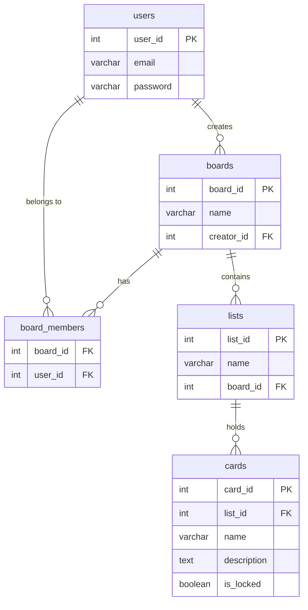

# Realtime Task Management Web App

A **Trello-inspired Kanban board** built with Flask and WebSockets. Multiple users can collaborate on shared project boards in real time — creating, editing, moving, and deleting cards without refreshing the page, with a live chat system per board.

🚀 **Live Demo:** [https://taskflow-app-685140135697.us-central1.run.app](https://taskflow-app-685140135697.us-central1.run.app)

---

## Table of Contents

- [Features](#features)
- [Tech Stack](#tech-stack)
- [System Architecture](#system-architecture)
- [Database Schema (ERD)](#database-schema-erd)
- [WebSocket Event Flow](#websocket-event-flow)
- [Project Structure](#project-structure)
- [Setup & Running](#setup--running)
- [Route Reference](#route-reference)
- [Security](#security)
- [Deploy to Google Cloud](#deploy-to-google-cloud)

---

## Features

| Feature | Description |
|---|---|
| Auth | Signup / Login / Logout with encrypted passwords |
| Boards | Create shared project boards, invite members by email |
| Kanban Lists | Three default columns per board: To Do / In Process / Completed |
| Active Users | Green-dot indicators showing who is currently in the board chat room |
| CI/CD | GitHub Actions pipeline — lint → test → Cloud Build → Cloud Run deploy |
| Cards | Add, edit, delete cards with task descriptions |
| Drag & Drop | Move cards between lists with drag and drop |
| Card Locking | Card is locked while one user edits it — prevents simultaneous edits |
| Real-time Sync | All board changes broadcast instantly to every connected user via WebSocket |
| Live Chat | Per-board group chat for active members |
| Persistent Storage | Full board state stored in MySQL, restored on every visit |
| Docker | One-command local setup via Docker Compose |
| Cloud Deploy | Deploy-ready for Google Cloud Run |

---

## Tech Stack

| Layer | Technology |
|---|---|
| Backend | Python 3, Flask |
| Real-time | Flask-SocketIO (threading mode) |
| Database | MySQL 8 |
| Frontend | Vanilla JS, HTML/CSS (Jinja2 templates) |
| Auth | scrypt (password hashing), Fernet (session encryption) |
| Containerization | Docker, Docker Compose |
| Cloud | Google Cloud Run |
| CI/CD | GitHub Actions + Google Cloud Build |

---

## System Architecture

```
┌─────────────────────────────────────────────────────────────────┐
│                         Browser (Client)                        │
│                                                                 │
│   ┌──────────────┐   ┌──────────────┐   ┌──────────────────┐   │
│   │   login.html │   │   home.html  │   │    board.html    │   │
│   │   login.js   │   │   main.js    │   │  card.js chat.js │   │
│   └──────┬───────┘   └──────┬───────┘   └────────┬─────────┘   │
│          │  HTTP POST        │  HTTP GET           │ WebSocket   │
└──────────┼───────────────────┼─────────────────────┼────────────┘
           │                   │                     │
           ▼                   ▼                     ▼
┌─────────────────────────────────────────────────────────────────┐
│                     Flask Application                           │
│                                                                 │
│  ┌─────────────────────────────────────────────────────────┐   │
│  │                       routes.py                         │   │
│  │                                                         │   │
│  │  HTTP Routes              SocketIO Events (/board ns)   │   │
│  │  ─────────────────        ──────────────────────────    │   │
│  │  GET  /login              connected / joined / left     │   │
│  │  POST /processlogin       new_card                      │   │
│  │  POST /processsignup      move_card                     │   │
│  │  GET  /logout             lock_card / unlock_card       │   │
│  │  GET  /home               update_card_description       │   │
│  │  POST /create_board       delete_card                   │   │
│  │  GET  /board/<id>         send_message                  │   │
│  └──────────────────────────────────────┬────────────────┘   │
│                                         │                       │
│  ┌──────────────────────────────────────▼────────────────┐    │
│  │               database.py (MySQL Layer)                │    │
│  │                                                        │    │
│  │  createUser()   authenticate()   getUserBoards()       │    │
│  │  createBoards() createCard()     query()               │    │
│  │  onewayEncrypt() reversibleEncrypt()                   │    │
│  └──────────────────────────────────────┬─────────────────┘   │
└─────────────────────────────────────────┼───────────────────────┘
                                          │
                          ┌───────────────▼──────────────┐
                          │         MySQL Database        │
                          │                              │
                          │  users  boards  board_members│
                          │  lists  cards                │
                          └──────────────────────────────┘
```

---

## Database Schema (ERD)



---

## WebSocket Event Flow

All real-time events use the `/board` namespace. Each board has its own room (`board_<id>`), so events are scoped only to users viewing the same board.

```
Client A                    Flask-SocketIO Server              Client B, C...
────────                    ─────────────────────              ──────────────

── joined {board_id} ──►   join_room("board_<id>")
                           emit user_joined to room ─────────► "X joined" status message
                           emit active_users to room ────────► green-dot user list updates

── new_card {list_id} ──►  db.createCard()
                           emit new_card to room ─────────────► card appears on board

── lock_card {card_id} ──► emit lock_card to room ───────────► card greys out for others

── update_card ────────►   db.query(UPDATE cards)
                           emit card_updated to room ─────────► card text updates live

── unlock_card ─────────►  emit unlock_card to room ─────────► card becomes editable again

── move_card {list_id} ──► db.query(UPDATE cards)
                           emit card_moved to room ──────────► card moves to new list

── delete_card ─────────►  db.query(DELETE cards)
                           emit card_deleted to room ─────────► card disappears

── send_message {msg} ──►  emit message to room ─────────────► chat message appears

── left {board_id} ─────►  leave_room("board_<id>")
                           emit user_left to room ──────────► "X left" status message
                           emit active_users to room ────────► green-dot user list updates
```

---

## Project Structure

```
realtime-task_management-web/
│
├── app.py                          # Entry point — starts Flask + SocketIO server
├── requirements.txt                # Python dependencies
├── requirements-test.txt           # Test-only dependencies (pytest)
├── Dockerfile-dev                  # Docker image (used by Cloud Build)
├── docker-compose.yml              # Local dev setup
├── cloudbuild.yaml                 # Cloud Build config — builds from Dockerfile-dev
│
├── .github/
│   └── workflows/
│       └── ci.yml                  # CI/CD pipeline: lint → test → build → deploy
│
└── tests/
    ├── conftest.py                 # Fixtures — app factory, DB mock, auth client
    └── test_app.py                 # 11 tests: register, login, board, card CRUD
│
└── flask_app/
    ├── __init__.py                 # App factory — creates Flask app, inits SocketIO
    ├── routes.py                   # All HTTP routes + WebSocket event handlers
    │
    ├── utils/
    │   └── database/
    │       └── database.py         # All DB operations + encryption helpers
    │
    ├── database/
    │   └── create_tables/
    │       ├── users.sql           # users table schema
    │       ├── boards.sql          # boards table schema
    │       ├── board_members.sql   # board_members join table schema
    │       ├── lists.sql           # lists table schema
    │       └── cards.sql           # cards table schema (includes is_locked flag)
    │
    ├── templates/
    │   ├── shared/
    │   │   └── layout.html         # Base HTML layout (navbar, shared structure)
    │   ├── login.html              # Signup / Login page
    │   ├── home.html               # Dashboard — board list + create board
    │   └── board.html              # Kanban board page with live updates
    │
    └── static/
        ├── login/
        │   ├── css/login.css
        │   └── js/login.js         # Async signup/login via fetch
        └── main/
            ├── css/
            │   ├── main.css
            │   ├── board.css
            │   ├── navbar.css
            │   └── chat.css
            └── js/
                ├── main.js         # Board creation, home page logic
                ├── card.js         # Card CRUD, drag & drop, lock/unlock
                └── chat.js         # SocketIO chat connection & messaging
```

---

## Setup & Running

### Option 1 — Docker (recommended)

```bash
# Clone and enter the project
cd realtime-task_management-web

# Start the app (Flask on port 8080)
docker-compose up --build
```

Open `http://localhost:8080`

> MySQL is expected to be running separately (or add a `db` service to `docker-compose.yml`).  
> Update the host/user/password in `flask_app/utils/database/database.py` to match your MySQL config.

---

### Option 2 — Local (without Docker)

```bash
# Install dependencies
pip install -r requirements.txt

# Make sure MySQL is running and a database named 'db' exists
mysql -u root -p -e "CREATE DATABASE db;"

# Run the app
python app.py
```

Open `http://localhost:8080`

---

### MySQL Configuration

Edit `flask_app/utils/database/database.py`:

```python
self.database = 'db'
self.host     = '127.0.0.1'
self.user     = 'master'
self.port     = 3306
self.password = 'master'
```

Tables are created automatically on first run (`db.createTables()`).

---

## Route Reference

### HTTP Routes

| Method | Route | Auth Required | Description |
|---|---|---|---|
| GET | `/` | No | Redirects to `/home` |
| GET | `/login` | No | Login / Signup page |
| POST | `/processlogin` | No | Authenticate user, set session |
| POST | `/processsignup` | No | Register new user |
| GET | `/logout` | Yes | Clear session, redirect to login |
| GET | `/home` | Yes | Dashboard — list boards, create board form |
| POST | `/create_board` | Yes | Create board + default lists + add members |
| GET | `/board/<id>` | Yes | View a Kanban board |

### WebSocket Events (`/board` namespace)

| Event (client → server) | Payload | Description |
|---|---|---|
| `joined` | `{board_id}` | Join board room, announce presence |
| `new_card` | `{board_id, list_id, card_name, description}` | Create card, broadcast to room |
| `move_card` | `{card_id, list_id, board_id}` | Move card to new list, broadcast |
| `lock_card` | `{card_id, board_id}` | Lock card for editing, broadcast |
| `unlock_card` | `{card_id, board_id}` | Unlock card, broadcast |
| `update_card_description` | `{card_id, description, board_id}` | Save card text, broadcast |
| `delete_card` | `{card_id, board_id}` | Delete card from DB, broadcast |
| `send_message` | `{board_id, msg}` | Send chat message to board room |
| `left` | `{board_id}` | Leave board room, announce departure |

| Event (server → client) | Triggered by | Description |
|---|---|---|
| `user_joined` | joined | Broadcast username of user who just joined |
| `user_left` | left | Broadcast username of user who just left |
| `active_users` | joined / left | Full list of users currently in the room |
| `new_card` | new_card | New card appears on all clients |
| `card_moved` | move_card | Card moves to new list for all clients |
| `lock_card` | lock_card | Card greys out for all other clients |
| `unlock_card` | unlock_card | Card becomes editable for all clients |
| `card_updated` | update_card_description | Card text updates for all clients |
| `card_deleted` | delete_card | Card disappears for all clients |
| `message` | send_message | Chat message displayed in chat window |

---

## Security

| Concern | Implementation |
|---|---|
| Password storage | `hashlib.scrypt` (one-way, salted) — passwords are never stored in plain text |
| Session data | Email stored in session as Fernet-encrypted ciphertext (reversible encryption) |
| Route protection | `@login_required` decorator — redirects unauthenticated requests to `/login` |
| Concurrent editing | `is_locked` flag in DB + `lock_card` / `unlock_card` WebSocket events prevent simultaneous card edits |

> **Note:** The Fernet key and scrypt salt are hardcoded for development. In production, move these to environment variables.

---

## CI/CD Pipeline

Pushing to `main` triggers the full pipeline automatically:

```
lint (flake8) → test (pytest) → Cloud Build (Docker image) → Cloud Run deploy
```

Required GitHub Secrets:

| Secret | Description |
|---|---|
| `GCP_SA_KEY` | GCP service account key JSON |
| `GCP_PROJECT_ID` | GCP project ID |
| `GCP_SERVICE_NAME` | Cloud Run service name |
| `GCP_REGION` | Cloud Run region (e.g. `us-central1`) |

---

## Deploy to Google Cloud

### Automatic (via GitHub Actions)

Push to `main` — the pipeline builds and deploys automatically.

### Manual

```bash
# Build and push via Cloud Build (uses Dockerfile-dev)
gcloud builds submit \
  --config cloudbuild.yaml \
  --substitutions _IMAGE_TAG=gcr.io/[YOUR_PROJECT_ID]/task-management-app:latest \
  --project [YOUR_PROJECT_ID]

# Deploy to Cloud Run
gcloud run deploy [YOUR_SERVICE_NAME] \
  --image=gcr.io/[YOUR_PROJECT_ID]/task-management-app:latest \
  --region=[YOUR_REGION] \
  --platform=managed \
  --allow-unauthenticated \
  --port=8080 \
  --memory=512Mi \
  --project=[YOUR_PROJECT_ID]
```

Replace values in `[...]` with your GCP project details.
